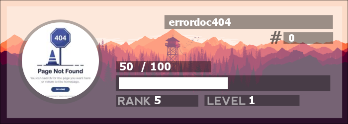

# Examples

[](https://www.npmjs.com/package/kdprod)
[](https://www.npmjs.com/package/kdprod)
[](https://www.npmjs.com/package/kdprod)

## Examples

<details open> 
    <summary>  Welcome Card  </summary>

```javascript
const { Client } = require("discord.js");
const { DiscordProfile } = require('kdprod');
const canvas = new DiscordProfile();

const client = new Client({
	intents: [
		GatewayIntentBits.Guilds,
		GatewayIntentBits.GuildMessages,
		GatewayIntentBits.MessageContent,
		GatewayIntentBits.GuildMembers,
	],
});

client.on('messageCreate', async (message) => {
    if (message.author.bot) return;
 
    let imageURL = 'https://i.imgur.com/ea9PB3H.png';
    const image = await canvas.welcome(message.author, { link: imageURL, blur: false });

    message.channel.send({ files: [image] });
});


client.login('Your-Bot-Token');
```


</details>

<details close> 
    <summary>  Rank Card  </summary>

```javascript
const { Client } = require("discord.js");
const { DiscordProfile } = require('kdprod');
const canvas = new DiscordProfile();

const client = new Client({
	intents: [
		GatewayIntentBits.Guilds,
		GatewayIntentBits.GuildMessages,
		GatewayIntentBits.MessageContent,
		GatewayIntentBits.GuildMembers,
	],
});

client.on('messageCreate', async (message) => {
    if (message.author.bot) return;
 
    try {

        let imageURL = 'https://i.imgur.com/ea9PB3H.png';
        const image = await canvas.rankcard({
            member: message.author,
            currentXP: 50,
            fullXP: 100,
            level: 1,
            rank: 5,
            link: imageURL
        });

        message.channel.send({ files: [image] });
    } catch (e) {
        console.log(e);
    }
});


client.login('Your-Bot-Token');
```



</details>